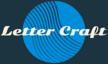

# Letter Craft
<div align="center">
  
</div>

[Letter Craft](https://migsrkrd.github.io/Letter-Craft/) is a simple and fun way to create and share your own custom letters. You can use Letter Craft to create message templates for your emails, cover letters, social media posts, and more.

## Table of Contents
- [Overview](#overview)
- [Features](#features)
- [Installation](#installation)
- [Usage](#usage)
- [Resources](#resources)
- [Contributing](#contributing)
- [License](#license)

## Overview
Letter Craft was created based on my experiences with job searching. It is imperative to get your information out there with applications, but it's also important to make sure that your message is clear and concise. This is where Letter Craft comes in. You can create your own templates and use them to send out your information quickly and efficiently.

## Features
- **Template Dashboard:** View your saved templates, create new ones, and share them with others.
- **Customization:** Use AI programs like ChatGPT, WriteSonic, and Rytr to generate template content.
- **Resources:** Access various resources to enhance your template creation process.
- **Documentation:** Instructions on how to use Letter Craft.
- **Contact Information:** Find ways to contact the creator for further assistance.

## Installation
To run Letter Craft locally, follow these steps:

1. Clone the repository:
    ```bash
    git clone https://github.com/Migsrkrd/Letter-Craft.git
    ```

2. Navigate to the project directory:
    ```bash
    cd Letter-Craft
    ```

3. Open `index.html` in your preferred web browser.

## Usage
To use Letter Craft:

1. Open the [Letter Craft website](https://migsrkrd.github.io/Letter-Craft/).
2. Navigate through the various sections using the navigation bar:
   - **Home:** Learn about Letter Craft.
   - **Template Dashboard:** Manage your templates.
   - **Contact:** Get in touch with the creator.
   - **Documentation:** Find instructions on how to use the application.
   - **Resources:** Explore additional tools for template creation.

## Resources
For template inspiration, we recommend using AI programs like ChatGPT, WriteSonic, and Rytr. These applications typically generate templates in the required syntax for Letter Craft. If they don’t, you can easily request the correct format directly afterward.

Here are some additional websites and applications that can be useful for creating your templates. Use these tools to craft your initial content, copy it into Letter Craft, and then edit it to suit your needs.

- [ChatGPT](https://www.openai.com/gpt-3/)
- [WriteSonic](https://www.writesonic.com/)
- [Rytr](https://www.rytr.me/)

## Contributing
This project does not currently accept contributions. If you have suggestions for improvements, please reach out to the creator through the [Contact](https://migsrkrd.github.io/Letter-Craft/contact/contact.html) page.

## License
This project is licensed under the MIT License.

---

## License
This project is licensed under the [MIT License](https://opensource.org/licenses/MIT).

